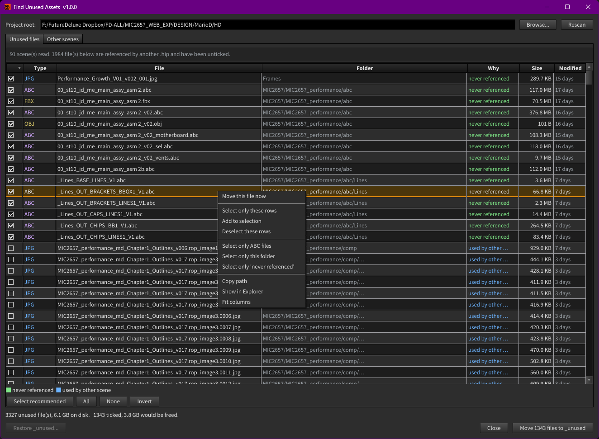
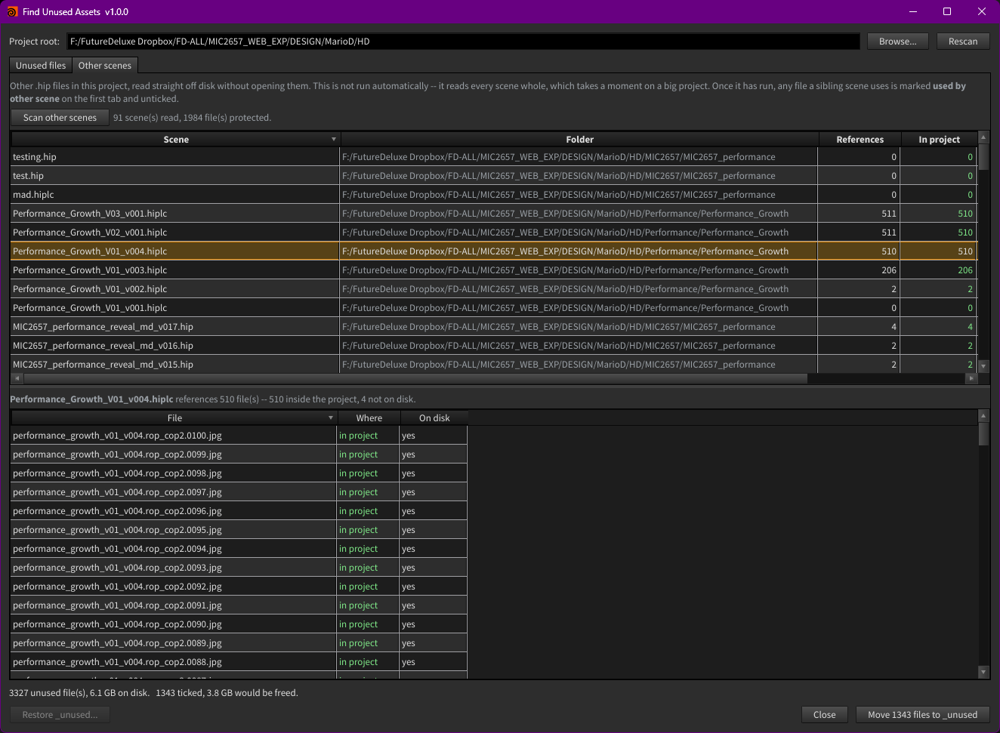

# Houdini Asset Cleaner

A Houdini tool that finds files in your project folder that nothing is using,
and moves them out of the way -- without deleting anything.

The companion to [Asset Consolidator](../AssetConsolidator). That one pulls
outside files *in*; this one finds what is left over once you are done. Useful
before archiving a shot or handing a project on, when a folder has collected
years of test caches and texture versions nobody can identify any more.

Houdini 20.5+ | Windows, macOS, Linux | GPL-3.0

Menu: **Tools > Find Unused Assets**

Everything the open scene does not reference, why each one is safe to remove,
and what it costs on disk. Green rows are ticked; blue ones are used by another
scene and left alone. Right-click isolates a group -- one file type, one
folder, one reason:

## What it does

1. Walks every file parameter in the open scene to build the *used* set.
2. Walks the project folder on disk.
3. Anything on disk that nothing points at is an orphan.
4. You tick what you want; "Move to _unused" relocates it.

Step 1 covers the open scene only. To account for the **other** scenes in the
project, press **Scan other scenes** on the second tab -- see below.

Nothing is deleted. Files go to `<root>/_unused/`, keeping their folder
structure, and **Restore** puts them all back.

## The two tabs

### Unused files

The orphans, with a **Why** column saying how safe each one is to remove.
Only the first two are ticked for you:

| Why | Meaning | Ticked |
|---|---|---|
| `never referenced` | Nothing in the open scene points at it | yes |
| `backup file` | Named `_bak`, `_old`, `- Copy` and so on | yes |
| `older version` | A `_v001` where a `_v002` exists beside it | no |
| `partial sequence` | A frame outside the range the scene uses | no |
| `sidecar of used file` | A `.mtl` beside a used `.obj`, a `.tx` beside a used `.exr` | no |
| `used by other scene` | Another `.hip` in the project references it | no |

Anything hinting that something else depends on the file stays unticked. You
can still tick it by hand -- the tool never blocks you, it just refuses to
volunteer.

### Other scenes

Press **Scan other scenes** to read every other `.hip` in the project. A
progress bar tracks it and Cancel stops it partway.

This does not run on its own, and it does not run on rescan. It reads each
scene whole -- around 50 MB/s -- which is nothing for a handful of files and
a visible stall on a project carrying years of versions. Making it a button
keeps the ordinary rescan instant.

Once it has run, any file a sibling scene references is marked `used by other
scene` on the first tab and unticked. The banner above the table tells you
which state you are in: **orange** until you have scanned, neutral after.

The table lists each scene, what it references, how much of that is inside the
project, and how many of its references are missing from disk. Select a scene
to list its files.

91 scenes read here, and 1984 files that looked unused turned out to be
referenced by one of them.

This tab is what makes the first tab trustworthy, once you run it. A
`.hip` is a CPIO archive whose
payload is plain uncompressed text, so the paths a closed scene references can
be read without opening it -- no Houdini session, no waiting. `$HIP` and `$JOB`
are expanded against that scene's own folder, so a sibling using
`$HIP/tex/x.exr` resolves to the same file the open scene would see.

Right-click a row on the first tab and choose **Show scenes using this file**
to jump straight here.

## What is never touched

- **Non-asset files.** Only images, geometry and caches are ever considered.
  A `.txt`, `.py` or spreadsheet is left alone -- "no parameter points at it"
  is not evidence that a document is rubbish.
- **The `.hip` files themselves**, and anything in `_unused`, `backup`,
  `.git` or `tmp`.
- **Files the open scene uses**, including every frame of a sequence it
  resolves and both halves of a `$F`/`<UDIM>` pattern.

### Sequences and unresolved variables

Two cases are easy to get wrong, so they are handled explicitly:

- A scene pointing at **one explicit frame** (`fire.0001.exr` rather than
  `fire.$F4.exr`) still protects the rest of that sequence. The neighbours
  are listed as `partial sequence` and never ticked, so a live frame range
  cannot be swept up by "Select recommended".
- A path holding a variable Houdini only expands at cook time (`$HIPNAME`,
  `$OS`, `$SF` in a sim checkpoint) is **globbed** rather than treated as one
  unmatchable filename. Matching too many files is safe here; it can only mark
  something as still in use.

## Safety

By default the scan knows only the open scene. **A file another scene uses
will look unused until you press Scan other scenes** -- that is why the first
tab warns you in orange until you have. Beyond that:

- A path built by an **expression** at cook time may not be found by either
  method. Check the count on the Other scenes tab looks plausible before
  trusting a big selection.
- Scenes **outside** the project folder that reference files inside it are not
  seen at all.
- The move is reversible, so the recovery from a mistake is one button. That
  is deliberate: it is the reason the tool moves rather than deletes.

Run it on a copy of a project the first time.

## Sequences

A render folder holds thousands of frames, and one row each buries everything
else. Numbered frames are collapsed into a single row:

    beauty.[0001-0240].exr  (240 files)      render      689.4 MB

The row carries the whole sequence: its size is the total, its date is the
newest frame, and ticking it moves every frame. Hover the name to see the
individual files.

Frames are only grouped when they share a folder **and** an extension, so
`cache.0001.bgeo` and `cache.0001.exr` stay separate.

A sequence takes the **most cautious** reason of any frame in it. If one frame
of an otherwise unused sequence is referenced by another scene, the whole row
reads `used by other scene` and is not ticked -- because ticking it would move
that frame too. Such a row shows a partial tick.

Untick **Group sequences** to go back to one row per file.

## Table

- **Click a column heading** to sort. Size sorts by bytes and Modified by
  actual date, not as text.
- **Drag a divider** to resize, **double-click the header** to fit everything.
- **Double-click a row** to open the file in whatever app the OS associates
  with it -- the fastest way to decide whether a mystery cache matters.
- **Right-click** to move a single file, open it, copy its path, show it in
  Explorer, or isolate a group: one type, one folder, one reason.

## Install

See [INSTALL.md](INSTALL.md). Short version: put the folder somewhere, point a
Houdini package `.json` at it, restart Houdini.

## Tests

    python tests/run_all.py

No Houdini and no dependencies -- `hou` and PySide are stubbed. The move,
restore and `.hip` reading are tested against real files in a temp folder.

## Status

Young. The logic is covered by tests, but it has not been through years of
production projects. It moves rather than deletes precisely because of that.

## Licence

GPL-3.0. See [LICENSE](LICENSE).
